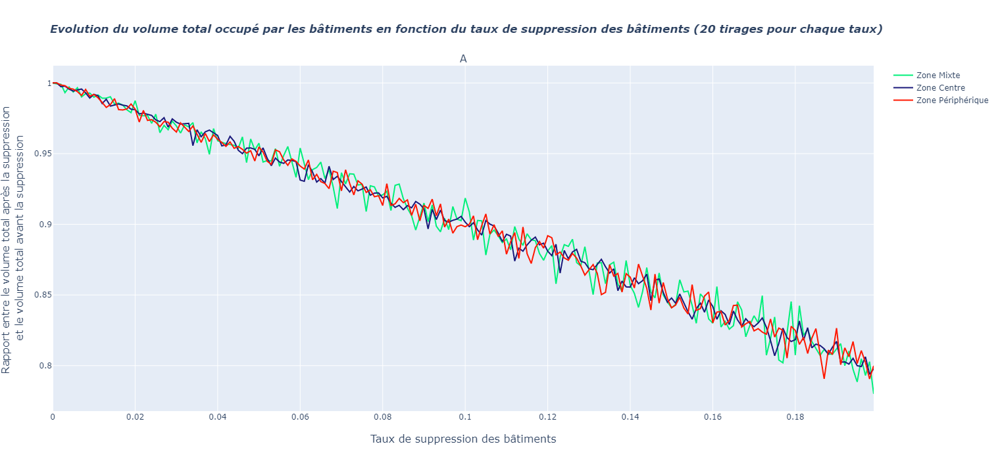

# Analyse de Sensibilité, Projet Recherche

## Table des matières
1. [Architecture du projet Git](##Architecture-du-projet-Git)

      1.1 [Données d'entrée](###1.1)

2. [Indicateurs sélectionnés et perturbations](##Indicateurs-sélectionnés-et-perturbations)

3. [Résultats](##3)

      3.1 [Facteur de forme et modification de géométrie](###3.1)

      3.2 [Aire et suppression de bâtiments](###3.2)

      3.3 [Aire et modification de géométrie](###3.3)

      3.4 [Aire avec modification de géométrie et suppression de bâtiments](###3.4)

      3.5 [Volume et suppression de bâtiments](###3.5)

      3.6 [Volume et modification de géométrie](###3.6)

      3.7 [Volume avec modification de géométrie et suppression de bâtiments](###3.7)

      3.8 [Commentaires sur les autres indicateurs et perturbations](###3.8)

4. [Librairies et outils utilisés pour le développement](##4)

5. [Versions](##5)

6. [Auteurs](##6)

## 1. Architecture du projet Git
### 1.1 Données d'entrée
Les données d'entrée sont présentes sous forme de Shapefile dans les dossiers *donneesZoneOSM* et *donneesZoneBDTOPO*. Les fichiers présents dans ces dossiers sont des fichiers Shapefile.
En ce qui concerne les codes pour les paramètres **Facteur de forme**, **Aire** et **Volume**, les données en entrée correspondent aux fichiers JSON du dossier *Fichier_JSON*.

Zones sélectionnées :

      1. Zone Centre (Zone située au centre-ville de Toulouse 400m sur 400m)
      2. Zone Mixte (Zone située juste à l'extérieur du centre-ville de Toulouse 400m sur 400m)
      3. Zone Périphérique (Zone située en banlieue pavillonaire de Toulouse 400m sur 400m)

Ci-dessous, une carte présentant les zones utilisées.

Le code de notre projet se situe dans le dossier *python*. 
A l'ouverture du dossier *python*, on trouve un code par indicateur ainsi que des dossiers *perturbations* et *traitement*. Ils comportent des codes réutilisables, effectuant des traitements sur les fichiers JSON correspondants aux couches précédentes.

Les résultats sont présents dans le dossier *Annexes*. Les fichiers html se répartissent dans les dossiers *Aire*, *Volume* et *Form Factor* tandis que le dossier *Autre* est conctitué de captures d'écran servant notamment pour ce document.

## 2. Indicateurs sélectionnés et perturbations
Les indicateurs ont été choisis parmi ceux du projet [OrbisGeoclimate](https://github.com/orbisgis/geoclimate/wiki/Output-data). Nous avons entre autre implémenté les suivants :

* **FormFactor** ou facteur de forme. Il s'agit de l'aire d'un bâtiment divisée par son périmètre au carré. Pour plus de renseignements sur cet indicateur, voir [interpretation_formfactor.md](/Annexes/FormFactor/interpretation_formfactor.md) )

* **Aire**. Aire des bâtiments de la couche -- somme des aires des bâtiments de la couche.
 
* **Volume**. Volume des bâtiments de la couche -- somme des volumes des bâtiments de la couche.

Pour chaque indicateur, on peut trouver des perturbations intéressantes à appliquer pour effectuer ensuite une analyse de sensibilité. Le tableau ci-dessous récapitule les choix que nous avons effectués.

(pour le fonctionnement des codes des perturbations, voir le fichier [explication.md](/python/perturbations/explication.md)

|   Tableau des couples  Indicateur - Perturbation  |                          | Facteur de Forme |     Aire      | Volume  | Distance  Bati-Bati | Distance  Bati-Route |
|:-------------------------------------------------:|--------------------------|------------------|:-------------:|---------|:-------------------:|----------------------|
|              Suppression  de bâtiments            |                          |                  | OSM & BD TOPO | BD TOPO |                     |                      |
|               Modification de géométrie           |  Sommets  des  polygones |   OSM & BD TOPO  | OSM & BD TOPO | BD TOPO |                     |                      |
|                                                   | Hauteurs  des  bâtiments |                  |               | BD TOPO |                     |                      |
|              Fusion de bâtiments                  |                          |                  |               |         |                     |                      |

Une perturbation supplémentaire qui a été envisagée correspond à la translation de bâtiments. Cependant, le problème de superposition des bâtiments dans des zones denses comme au niveau du centre-ville de Toulouse reste majeur. La superposition des bâtiments reste un obstacle lorsque l'on souhaite calculer des distances bâtiments-route ou encore des distances bâti-bâti.

## 3. Résultats
### 3.1 Facteur de forme et modification de géométrie
** Pour les données de la BD TOPO **

** Pour les données OSM **

Tout d'abord, les courbes sont décroissantes : plus l'erreur de positionnement est importante, plus le facteur de forme sera petit. Cela s'explique par le fait que les géométries obtenues sont de plus en plus tordues, et les angles deviennent très aigus ou obtus. Les bâtiments sont alors moins compacts, et leur facteur de forme diminue.
Les exemples présentés dans le fichier [interpretation_formfactor.md](/Annexes/FormFactor/interpretation_formfactor.md) permettent de bien le visualiser
Le facteur de forme est plus grand pour la zone périphérique, car les bâtiments sont originellement plus carrés que ceux du centre-ville.
En zone périphérique, le modèle de logement est celui des maisons pavillonaires, ce qui diffère avec les barres d'immeubles du centre-ville.

Lorsque la moyenne des modifications de géométrie est assez importante, les résultats tendent à être similaires pour les 3 zones. En effet, au dessus de 3m, on peut considérer que la perturbation n'est pas réaliste et que les déformations sont telles que polygones de la couche n'ont plus rien à voir avec leur forme initiale. 

**Aucune différence apparente ou suffisamment marquante pour être notée entre les deux sources de données**. 
Le résultat du calcul de cet indicateur après modification de la géométrie est similaire pour OSM et pour la BD TOPO.
      
### 3.2 Aire et suppression de bâtiments

On observe des courbes linéaires, ainsi, lorsque l'on supprime un certain pourcentage de bâtiments, il en résulte une diminution du rapport entre l'aire obtenue après suppression et l'aire initiale. C'est une relation de proportionnalité qui n'est malheureusement pas intéressante puisqu'elle peut se démontrer mathématiquement.

Cependant nous avons remarqué que nous pouvions faire ressortir des différences entre les sources de données en choisissant l'ordre dans lequel on supprime les bâtiments. En effet, en ordonnant les bâtiments selon leurs aires croissantes, et en supprimant ces derniers dans l'ordre dans lequel ils apparaissent, des différences notables entre les couches apparaissent. Nous obtenons les courbes ci-dessous :

Ainsi, avec cette méthode, plus le taux de suppression augmente, plus nous supprimons des gros bâtiments.Les bâtiments les plus petits sont supprimés en premier d'où une décroissance faible pour des taux de suppression faibles. Ensuite, quand le taux de suppression augmente, la pente des courbes augmente car la suppression concerne plus particulièrement les gros bâtiments. 

Il est intéressant d'observer les résulats en particulier pour la zone Centre en bleu sur les courbes. En effet, on observe que pour la zone centre, la décroissance est plus rapide pour les données OSM que pour les données BD TOPO. \\

**Comment expliquer ces différences entre les courbes des données OSM et BD TOPO?**

** Comparaison entre les données OSM et les données BD TOPO sur la zone Centre **

** Sources des données OSM **

** Sources des données BD TOPO **

On constate que les données BD TOPO présentent plus de bâtiments que les données OSM (460 pour BD TOPO contre 388 pour OSM dans la zone centre) pour une zone similaire. Comme on le voit sur l'échantillon de zone présenté ci-dessus, les bâtiments OSM recoupent de nombreux bâtiments IGN. Ainsi les données IGN présentent un découpage plus fin des bâtiments. Cette différence peut s'expliquer en comparant la manière dont sont produites les données
 Comme on le voit dans les figures ci-dessus, les données OSM ne sont pas mises à jour depuis 2009 en ce qui concerne les bâtiments de cet îlot. De plus elles ne sont pas contrôlées contrairement aux données de l'IGN.

Bien que ce résultat soit intéressant, il n'a pas vraiment été obtenu par une analyse de sensibilité et n'a pas sa place au milieu des autres résultats. Il est complémentaire à notre étude mais intéressant. 

### 3.3 Aire et modification de géométrie

Sur cette nappe de chaleur, l'axe des abscisses indique l'écart-type choisi pour notre modification des bâtiments tandis que la moyenne figure en ordonnée. Ainsi chaque couple (x,y) représente les paramètres selon lesquels la couche d'entrée est modifiée. La modification se fait comme expliquée dans les parties précédentes.
La couleur dont l'échelle figure à droite de la courbe représente un rapport d'erreur sur l'aire. Pour chaque couple (x,y), on modifie 10 fois la couche d'entrée selon ces paramètres et pour chacune de ces modifications, on calcule l'aire totale de la couche modifiée que l'on divise par l'aire totale initiale. La moyenne de ces 10 tirages aléatoires permet d'obtenir la valeur z représentée par une couleur. La nappe représentée ci-dessus correspond aux données de la zone Centre. 
Le premier affichage est celui de la BD TOPO, le second celui d'OSM et enfin, nous avons une nappe des différences entre les deux précédentes.

L'intéret principal d'effectuer cette modification de géométrie est de pouvoir détecter des différences dans les géométries que l'on ne perçoit pas forcément lors d'une visualisation sous un SIG. C'était une des attentes avant d'implémenter les algorithmes. En effet, on peut facilement imaginer que pour une façade droite (segment entre deux sommets du polygone), une source de données ne représente qu'un segment entre deux points, tandis qu'une autre représente une ligne brisée avec des angles proches de 180°(donc proche d'une droite).

Malheureusement, on n'observe aucune différence majeure entre les nappes de chaleur OSM et BD TOPO. On le voit sur la troisième nappe de chaleur (nappe des différences). On peut simplement observer que l'erreur sur l'aire est croissante plus la modification de géométrie augmente. Avec un écart-type sigma plus grand que 1, on peut obtenir des erreurs plus importantes tout en gardant une moyenne Mu plus faible.

En conclusion ces résultats ne sont pas forcément concluant pour comparer la qualité des données OSM et BD TOPO, en particulier si l'on reste dans la zone de perturbation réaliste où la moyenne et l'écart-type sont relativement faibles.

Ci-dessous, voici les résultats pour les autres zones :

![Aire/Modifgeom [Zone Centre]](Annexes/Autres/aire_modification_zonecentre.png "Nappe de chaleur présentant le taux d'erreur sur l'aire en fonction de la modification des bâtiments [Zone Centre]")

![Aire/Modifgeom [ZonePériphérique]](Annexes/Autres/aire_modification_zoneperi.png "Nappe de chaleur présentant le taux d'erreur sur l'aire en fonction de la modification des bâtiments [Zone Périphérique]")

### 3.4 Aire avec modification de géométrie et suppression de bâtiments

### 3.5 Volume et suppression de bâtiments 

De manière similaire à l'aire, il n'y a aucun résultat intéressant à tirer de ce couple car la courbe obtenue se rapproche d'une droite dont on peut déterminer le coefficient directeur par un calcul. En effet, plus on diminue le nombre de bâtiments, plus le volume diminue et cela de manière proportionnelle lorsque les bâtiments sont supprimés au hasard.

### 3.6 Volume et modification de géométrie

Étudier le volume des bâtiments permet de mêler les attributs de hauteur de la base de donnée avec la géométrie des bâtiments. Il n'est malheureusement pas possible de comparer BD TOPO et OSM sur ce type d'indicateur car les données OSM ne possèdent pas l'attribut "hauteur des bâtiments".

Pour le calcul du volume avec une incertitude sur la géométrie, on obtient une carte de chaleur.
La couleur est la coordonnée z qui correspond au taux d'erreur sur le volume c'est à dire le rapport entre le volume calculé avec la perturbation et le volume initial (cela sur une moyenne de 10 tirages aléatoires indépendants). La perturbation est une modification de géométrie déterminée par une moyenne (coordonnée y) et un écart-type(coordonnée x)

Il est intéressant de noter que l'erreur sur le volume dépasse 2% lorsque l'erreur sur la géométrie dépasse 2.5m (ce qui est déjà suffisant pour déformer la couche d'une manière peu réaliste). Cependant, cette valeur peut être atteinte pour de grands écart-types. La ligne rouge présente une séparation grossière des zones où l'erreur sur le volume peut dépasser 2%.

Pour le volume, les données OSM ne possédant pas l'attribut hauteur des bâtiments, nous ne pouvons pas comparer ces sources de données entre elles. En revanche, il est intéressant de voir les différences entre les nappes de chaleur pour les trois zones. L'échantillon présent dans le tableau ci-dessous est représentatif de l'ensemble des trois nappes. Il a été obtenue en regardant l'erreur obtenue sur le volume avec des écart-types et des moyennes fixées.
Voici les nappes des trois zones d'étude :

")

")

")

Pour les 3 zones, les nappes se ressemblent, mais malgré les ressemblances, on distingue des écarts intéressants sur les valeurs d'erreur. on en extrait un échantillon dans le tableau suivant:

|                                | Périphérique | Centre | Mixte |
|--------------------------------|--------------|--------|-------|
|           Ecart-type           | 0.8          | 0.8    | 0.8   |
|    Modification de géométrie   | 1.5          | 1.5    | 1.5   |
| Rapport d'erreur sur le volume | 0.01         | 0.002  | 0.003 |

On observe que si l'erreur sur le volume est sensiblement la même à paramètres égaux pour les zones Centre et Mixte, il existe une différence notable en ce qui concerne la zone Périphérique où l'on peut observer un rapport d'erreur sur le volume bien plus important. 
Cela est lié au fait que le volume prend en compte la hauteur des bâtiments. Or la moyenne pour la modification de géométrie s'applique de la même manière sur les sommets des bâtiments que sur leur hauteur. Comme les bâtiments de la zone Périphérique sont généralement des maisons pavillonaires, alors la perturbation appliquée sur la hauteur entraîne une plus forte erreur que sur les grands immeubles des zones Centre et Mixte. 

*Ce résultat certes intéressant n'est malgré tout pas un résultat sur la qualité des données.*

### 3.7 Volume avec modification de géométrie et suppression de bâtiments
")
**Pour la zone Centre**

")
**Pour la zone Mixte**

")
**Pour la zone Mixte**

Comme on l'observe ci-dessus, nous avons fait le choix d'afficher ici le résultat sur la Zone Centre de Toulouse. Pour les autres zones, le comportement est le même.
Sur ce graphe, on observe que l'influence du taux de suppression sur le volume total de la couche de bâtiments est bien plus prépondérante que celle de la modification de géométrie. Si l'on s'intéresse à **l'intersection** entre le plan qui correspond à 5% d'erreur et la nappe obtenue, on a une légère courbure, que l'on expliquait en 2D avec les nappes de chaleur précédentes. Cependant malgré cela, on constate tout de même la forte influence du taux de suppression, *il est prépondérant*. 

Enfin, il est intéressant de noter que pour la zone périphérique, l'erreur de 5% sur le volume peut être atteinte pour un taux de suppression faible. Cela est lié au fait que les bâtiments sont plus petits et moins hauts en zone périphérique et donc que les perturbations identiques aux autres zones ont plus de répercutions.

### 3.8 Commentaires sur les autres indicateurs et perturbations
Pour ce qui est de la fusion voir le markdown correspondant dans le dossier Python/Perturbation. Les fonctions de calcul des distances Bati-Bati et distance Bati-Route sont également présentes dans ce fichier mais elles utilisent Arcpy (Arcgis) et les perturbations que nous avons implémentées ne sont pas pertinentes avec ces indicateurs.

## 4. Librairies et outils utilisés pour le développement

Les logiciels et ressources suivants ont été utilisés pour le développement du projet:

* [Spyder] (https://www.spyder-ide.org/) - Editeur de code
* [Shapely] (https://pypi.org/project/Shapely/) - Géométrie des polygones
* [Plotly] (https://plotly.com/python/) - Production de graphes
* [Arcpy] (https://desktop.arcgis.com/fr/arcmap/10.3/analyze/arcpy/what-is-arcpy-.htm) - Module Python Arcgis

Pour les couches de données
* [BD TOPO] (www.ign.fr)
* [OSM] (https://www.openstreetmap.org)

## 5. Versions
0.6

## 6. Auteurs
* **Vincent HEAU** [VincentHeau] (https://github.com/VincentHeau)
* **Tristan FILLON** [TFillon] (https://github.com/TFillon)
* **Félix BAL** [fe73] (https://github.com/fe73)
