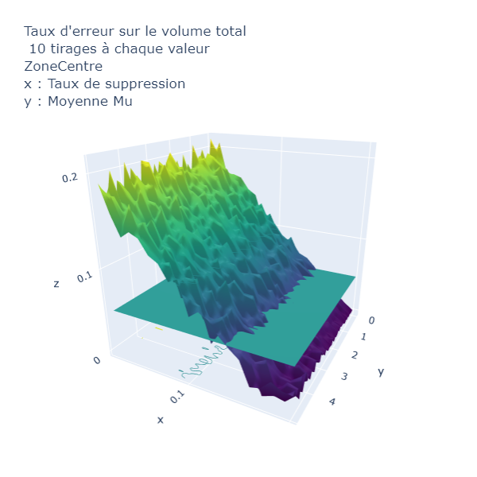
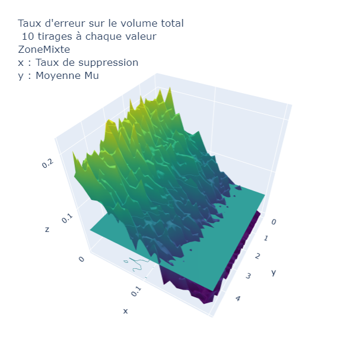

# Analyse de Sensibilité, Projet Recherche

## Table des matières
1. [Architecture du projet Git](##Architecture-du-projet-Git)

      1.1 [Données d'entrée](###1.1)

2. [Indicateurs sélectionnés et perturbations](##Indicateurs-sélectionnés-et-perturbations)

3. [Résultats](##3)

      3.1 [Facteur de forme et modification de géométrie](###3.1)

      3.2 [Aire et suppression de bâtiments](###3.2)

      3.3 [Aire et modification de géométrie](###3.3)

      3.4 [Aire avec modification de géométrie et suppression de bâtiments](###3.4)

      3.5 [Volume et suppression de bâtiments](###3.5)

      3.6 [Volume et modification de géométrie](###3.6)

      3.7 [Volume avec modification de géométrie et suppression de bâtiments](###3.7)

      3.8 [Commentaires sur les autres indicateurs et perturbations](###3.8)

4. [Librairies et outils utilisés pour le développement](##4)

5. [Versions](##5)

6. [Auteurs](##6)

## 1. Architecture du projet Git
### 1.1 Données d'entrée
Les données d'entrée sont présentes sous forme de Shapefile dans les dossiers *donneesZoneOSM* et *donneesZoneBDTOPO*. Les fichiers présents dans ces dossiers sont des fichiers Shapefile.
En ce qui concerne les codes pour les paramètres **Facteur de forme**, **Aire** et **Volume**, les données en entrée correspondent aux fichiers JSON du dossier *Fichier_JSON*.

Zones sélectionnées :

      1. Zone Centre ( Zone située au centre-ville de Toulouse 400m sur 400m )
      2. Zone Mixte ( Zone située juste à l'extérieur du centre-ville de Toulouse 400m sur 400m )
      3. Zone Périphérique ( Zone située en banlieue pavillonaire de Toulouse 400m sur 400m )

Ci-dessous, une carte présentant les zones utilisées
.

*Nappe3D* est un dossier qui présente des nappes obtenues avec ***plotly***, tandis que le code de notre projet se situe dans le dossier *python*. 
A l'ouverture du dossier *python*, on trouve un code par indicateur ainsi que des dossiers *perturbations* et *traitement*. Ils comportent des codes réutilisables, effectuant des traitements sur les fichiers JSON correspondants aux couches précédentes.

## 2. Indicateurs sélectionnés et perturbations
Les indicateurs ont été choisis parmi ceux du projet [OrbisGeoclimate](https://github.com/orbisgis/geoclimate/wiki/Output-data). Nous avons entre autre implémenté les suivants :

* **FormFactor** ou facteur de forme. Il s'agit de l'aire d'un bâtiment divisée par son périmètre au carré. Pour plus de renseignements sur cet indicateur, voir [interpretation_formfactor.md](/Annexes/FormFactor/interpretation_formfactor.md) )
* 
* **Aire**. Aire des bâtiments de la couche -- somme des aires des bâtiments de la couche.
* 
* **Volume**. Volume des bâtiments de la couche -- somme des volumes des bâtiments de la couche.

Pour chaque indicateur, on peut trouver des perturbations intéressantes à appliquer pour effectuer ensuite une analyse de sensibilité. Le tableau ci-dessous récapitule les choix que nous avons effectués.

(pour le fonctionnement des codes des perturbations, voir le fichier [explication.md](/python/perturbations/explication.md)

|   Tableau des couples  Indicateur - Perturbation  |                          | Facteur de Forme |     Aire      | Volume  | Distance  Bati-Bati | Distance  Bati-Route |
|:-------------------------------------------------:|--------------------------|------------------|:-------------:|---------|:-------------------:|----------------------|
|              Suppression  de bâtiments            |                          |                  | OSM & BD TOPO | BD TOPO |                     |                      |
|               Modification de géométrie           |  Sommets  des  polygones |   OSM & BD TOPO  | OSM & BD TOPO | BD TOPO |                     |                      |
|                                                   | Hauteurs  des  bâtiments |                  |               | BD TOPO |                     |                      |
|              Fusion de bâtiments                  |                          |                  |               |         |                     |                      |

## 3. Résultats
### 3.1 Facteur de forme et modification de géométrie
** Pour les données de la BD TOPO **

** Pour les données OSM **

Tout d'abord, les courbes sont décroissantes : plus l'erreur de positionnement est importante, plus le facteur de forme sera petit. Cela s'explique par le fait que les géométries obtenues sont de plus en plus tordues, et les angles deviennent très aigus ou obtus. Les bâtiments deviennent alors moins compacts, et leur facteur de forme diminue. Le facteur de forme est plus grand pour la zone périphérique, car les bâtiments sont originellement plus carrés que ceux du centre-ville. Ensuite, si l'on normalise les trois courbes, on se rend compte que celle de la zone périphérique décroît plus vite que les autres.

**Aucune différence apparente entre les deux sources de données**. 
Le résultat du calcul de cet indicateur après modification de la géométrie est similaire pour les deux sources de données.
      
### 3.2 Aire et suppression de bâtiments

### 3.3 Aire et modification de géométrie

L'intéret principal d'effectuer cette modification de géométrie est de pouvoir détecter des différences dans les géométries que l'on ne perçoit pas forcément lors d'une visualisation sous un SIG. En effet, on peut facilement imaginer que pour une façade droite (segment entre deux sommets du polygone), une source de données ne représente qu'un segment entre deux points, tandis qu'une autre représente une ligne brisée avec des angles proches de 180°(donc proche d'une droite).
**La modification de géométrie peut faire ressortir ces sommets "invisibles"**

Malheureusement, on n'observe aucune différence majeure entre les nappes de chaleur OSM et BD TOPO. On le voit sur la troisième nappe de chaleur (nappe des différences). On peut simplement observer que l'erreur sur l'aire est croissante plus la modification de géométrie augmente. Avec un écart-type sigma plus grande que 1, on peut obtenir des erreurs plus importantes tout en gardant une moyenne Mu plus faible.

En conclusion ces résultats ne sont pas forcément concluant pour comparer la qualité des données OSM et BD TOPO.

### 3.4 Aire avec modification de géométrie et suppression de bâtiments

### 3.5 Volume et suppression de bâtiments 

### 3.6 Volume et modification de géométrie

Pour le volume, les données OSM ne possédant pas l'attribut hauteur des bâtiments, nous ne pouvons pas comparer ces sources de données entre elles.
En revanche, il est intéressant de voir les différences entre les nappes de chaleur pour les trois zones. L'échantillon présent dans le tableau ci-dessous est représentatif de l'ensemble des trois nappes.
|                                | Périphérique | Centre | Mixte |
|--------------------------------|--------------|--------|-------|
|           Ecart-type           | 0.8          | 0.8    | 0.8   |
|    Modification de géométrie   | 1.5          | 1.5    | 1.5   |
| Rapport d'erreur sur le volume | 0.01         | 0.003  | 0.003 |

On observe que si l'erreur sur le volume est sensiblement la même à paramètres égaux pour les zones Centre et Mixte, il existe une différence notable en ce qui concerne la zone Périphérique où l'on peut observer un rapport d'erreur sur le volume bien plus important. 
Cela est lié au fait que le volume prend en compte la hauteur des bâtiments. Or la moyenne pour la modification de géométrie s'applique de la même manière sur les sommets des bâtiments que sur leur hauteur. Comme les bâtiments de la zone Périphérique sont généralement des maisons pavillonaires, alors la perturbation appliquée sur la hauteur entraîne une plus forte erreur que sur les grands immeubles des zones Centre et Mixte. 

### 3.7 Volume avec modification de géométrie et suppression de bâtiments

**Pour la zone Centre**

**Pour la zone Mixte**

Comme on l'observe ci-dessus, nous avons fait le choix d'afficher ici le résultat sur la Zone Centre de Toulouse. Pour les autres zones, le comportement est le même.
Sur ce graphe, on observe que l'influence du taux de suppression sur le volume total de la couche de bâtiments est bien plus prépondérante que celle de la modification de géométrie. Si l'on s'intéresse à **l'intersection** entre le plan qui correspond à 5% d'erreur et la nappe obtenue, on a une légère courbure. Cependant malgré cela, on constate tout de même la forte influence du taux de suppression, *il est prépondérant*. 
### 3.8 Commentaires sur les autres indicateurs et perturbations
Pour ce qui est de la fusion voir le markdown correspondant dans le dossier Python/Perturbation. Les fonctions de calcul des distances Bati-Bati et distance Bati-Route sont également présentes dans ce fichier mais elles utilisent Arcpy (Arcgis) et les perturbations que nous avons implémentées ne sont pas pertinentes avec ces indicateurs.

## 4. Librairies et outils utilisés pour le développement

Les logiciels et ressources suivants ont été utilisés pour le développement du projet:

* [Spyder] (https://www.spyder-ide.org/) - Editeur de code
* [Shapely] (https://pypi.org/project/Shapely/) - Géométrie des polygones
* [Plotly] (https://plotly.com/python/) - Production de graphes
* [Arcpy] (https://desktop.arcgis.com/fr/arcmap/10.3/analyze/arcpy/what-is-arcpy-.htm) - Module Python Arcgis

Pour les couches de données
* [BD TOPO] (www.ign.fr)
* [OSM] (https://www.openstreetmap.org)

## 5. Versions
0.6

## 6. Auteurs
* **Vincent HEAU** [VincentHeau] (https://github.com/VincentHeau)
* **Tristan FILLON** [TFillon] (https://github.com/TFillon)
* **Félix BAL** [fe73] (https://github.com/fe73)
