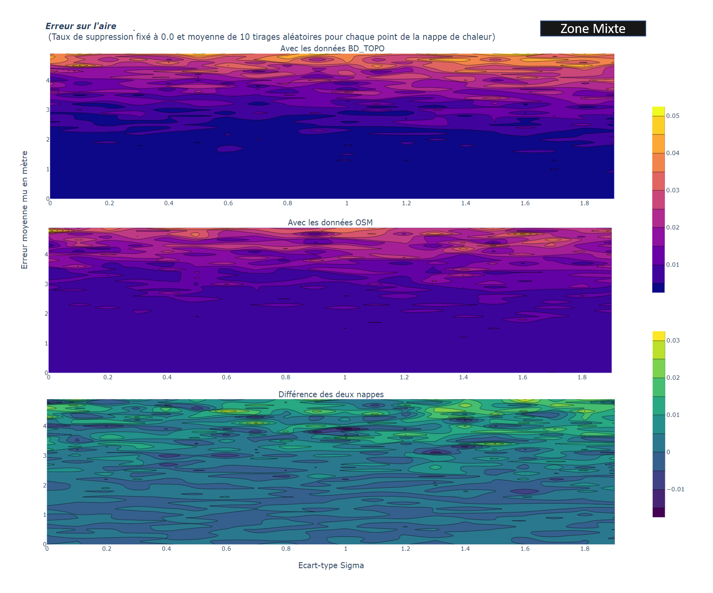
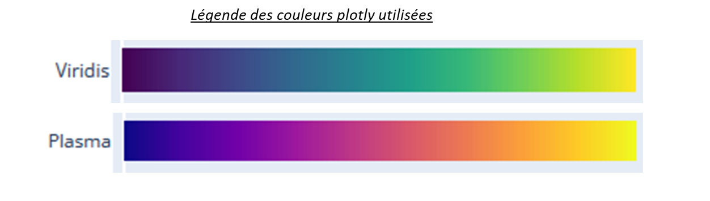
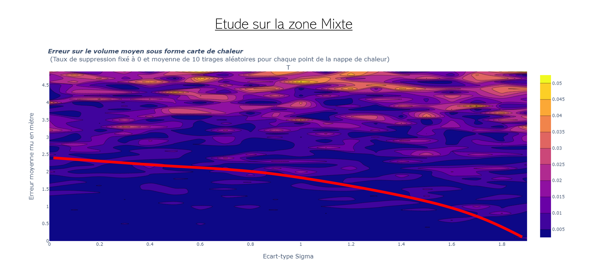
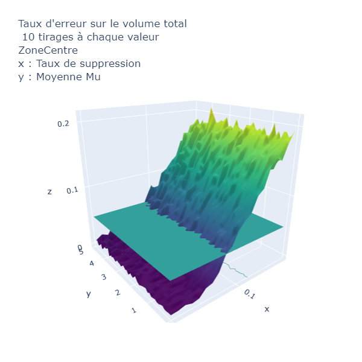

# Analyse de Sensibilité, Projet Recherche

## Table des matières
1. [Architecture du projet Git](##1. Architecture du projet Git)

      1.1 [Données d'entrée](###1.1)

2. [Indicateurs sélectionnés et perturbations](##2)

3. [Résultats](##3)

      3.1 [Facteur de forme et modification de géométrie](###3.1)

      3.2 [Aire et suppression de bâtiments](###3.2)

      3.3 [Aire et modification de géométrie](###3.3)

      3.4 [Aire avec modification de géométrie et suppression de bâtiments](###3.4)

      3.5 [Volume et suppression de bâtiments](###3.5)

      3.6 [Volume et modification de géométrie](###3.6)

      3.7 [Volume avec modification de géométrie et suppression de bâtiments](###3.7)

      3.8 [Commentaires sur les autres indicateurs et perturbations](###3.8)

4. [Librairies et outils utilisés pour le développement](##4)

5. [Versions](##5)

6. [Auteurs](##6)

## 1. Architecture du projet Git
### 1.1 Données d'entrée
Les données d'entrée sont présentes sous forme de Shapefile dans les dossiers *donneesZoneOSM* et *donneesZoneBDTOPO*. Les fichiers présents dans ces dossiers sont des fichiers Shapefile.
En ce qui concerne les codes pour les paramètres **Facteur de forme**, **Aire** et **Volume**, ceux sont les fichiers JSON du dossier *Fichier_JSON* qui sont utilisés.

Zones sélectionnées :

      1. Zone Centre ( Zone située au centre-ville de Toulouse 400m sur 400m )
      2. Zone Mixte ( Zone située juste à l'extérieur du centre-ville de Toulouse 400m sur 400m )
      3. Zone Périphérique ( Zone située en banlieue pavillonaire de Toulouse 400m sur 400m )

Ci-dessous, une carte présentant les zones utilisées
.

*Nappe3D* est un dossier qui présente des nappes obtenues avec ***plotly***, tandis que le code de notre projet se situe dans le dossier *python*. 
A l'ouverture du dossier *python*, on trouve un code par indicateur ainsi que des dossiers *perturbations* et *traitement*. Ils comportent des codes réutilisables, effectuant des traitements sur les fichiers JSON correspondants aux couches précédentes.

## 2. Indicateurs sélectionnés et perturbations
Les indicateurs ont été choisis parmi ceux du projet [OrbisGeoclimate](https://github.com/orbisgis/geoclimate/wiki/Output-data). Nous avons entre autre implémenté les suivants :

* **FormFactor** ou facteur de forme. Il s'agit de l'aire d'un bâtiment divisée par son périmètre au carré. Pour plus de renseignements sur cet indicateur, voir [interpretation_formfactor.md](/Annexes/FormFactor/interpretation_formfactor.md) )
* 
* **Aire**. Aire des bâtiments de la couche -- somme des aires des bâtiments de la couche.
* 
* **Volume**. Volume des bâtiments de la couche -- somme des volumes des bâtiments de la couche.

Pour chaque indicateur, on peut trouver des perturbations intéressantes à appliquer pour effectuer ensuite une analyse de sensibilité. Le tableau ci-dessous récapitule les choix que nous avons effectués.

(pour le fonctionnement des codes des perturbations, voir le fichier [explication.md](/python/perturbations/explication.md)

|   Tableau des couples  Indicateur - Perturbation  |                          | Facteur de Forme |     Aire      | Volume  | Distance  Bati-Bati | Distance  Bati-Route |
|:-------------------------------------------------:|--------------------------|------------------|:-------------:|---------|:-------------------:|----------------------|
|              Suppression  de bâtiments            |                          |                  | OSM & BD TOPO | BD TOPO |                     |                      |
|               Modification de géométrie           |  Sommets  des  polygones |   OSM & BD TOPO  | OSM & BD TOPO | BD TOPO |                     |                      |
|                                                   | Hauteurs  des  bâtiments |                  |               | BD TOPO |                     |                      |
|              Translation de bâtiments             |                          |                  |               |         |                     |                      |
|              Dichotomie de bâtiments              |                          |                  |               |         |                     |                      |
|              Fusion de bâtiments                  |                          |                  |               |         |                     |                      |

## 3. Résultats
### 3.1 Facteur de forme et modification de géométrie
** Pour les données de la BD TOPO **

** Pour les données OSM **

Tout d'abord, les courbes sont décroissantes : plus l'erreur de positionnement est importante, plus le facteur de forme sera petit. Cela s'explique par le fait que les géométries obtenues sont de plus en plus tordues, et les angles deviennent très aigus ou obtus. Les bâtiments deviennent alors moins compacts, et leur facteur de forme diminue. Le facteur de forme est plus grand pour la zone périphérique, car les bâtiments sont originellement plus carrés que ceux du centre-ville. Ensuite, si l'on normalise les trois courbes, on se rend compte que celle de la zone périphérique décroît plus vite que les autres.

**Aucune différence apparente entre les deux sources de données** 
Le résultat du calcul de cet indicateur après modification de la géométrie est similaire pour les deux sources de données.
      
### 3.2 Aire et suppression de bâtiments

**Réaction intéressante car elle dépend de la source de données** 
Pour OSM comme pour la BD TOPO, on calcule l'aire totale des bâtiments de la couche initiale (taux de suppression de 0). Ensuite, on perturbe les données en supprimant un taux de bâtiments (ce taux est la valeur présente sur l'axe des abscisses). La valeur en ordonnée lui correspondant est obtenue de la manière suivante :
A chaque taux de suppression, on effectue vingt tirages aléatoires de bâtiments à supprimer dans la couche. Et pour chacun de ces tirages, on calcule la nouvelle aire totale. On fait ensuite la moyenne de ces tirages pour obtenir la nouvelle aire moyenne. La dernière opération consiste à faire le rapport entre cette aire moyenne et l'aire totale de la couche initiale.

On observe clairement sur le graphique ci-dessus que les réactions aux suppressions sont différentes. Cela s'explique par la façon dont sont acquises et fabriquées les données de la BD TOPO et celles d'OSM. Pour l'expliquer, concentrons-nous sur la zone centre (*représentée en bleu sur les graphes*). 

Sur ces zones, on observe pour la BD TOPO, un pallier proche de 1 pour des taux de suppression faibles. Ainsi, lorsque l'on tire au hasard un faible nombre de bâtiments à supprimer et que l'on calcule l'aire après suppression, cette dernière est proche de l'aire initiale. Pour mieux le comprendre, il faut visualiser une représentation cartographique de la zone Centre. Pour la BD TOPO, on y observe **460 bâtiments**. Parmi ces bâtiments, on en compte quelques uns assez imposants et beaucoup de petits qui sont côte à côte et qui forment des îlots urbains. La forme de cette courbe indique que tant que l'on ne supprime pas plus de 5% des bâtiments de la zone Centre, on a une aire proche de l'aire initiale. Comme les bâtiments à supprimer sont tirés au hasard, on a beaucoup de chance de n'en supprimer que des petits qui n'influencent pas beaucoup l'aire totale. Dès que l'on dépasse 5% (environ) de suppression, on a plus de chance de supprimer les gros bâtiments ce qui explique la décroissance importante à plus de 5% de suppression.

Pour les données OSM, le comportement est très différent, ce pallier n'étant pas présent. Lorsque l'on regarde la couche de données OSM sur la même emprise, on ne perçoit pas au premier abord ce qui peut expliquer ce comportement différent. En regardant les entités de la couche, on  observe **388 bâtiments soit presque 100 de moins que pour la BD TOPO**. Or, l'emprise est la même, et en regardant rapidement les deux couches, celles-ci semblent identiques.
Mais, en zoomant précisant sur les îlots urbains, on observe qu'un îlot urbain est divisé en plus de bâtiments pour la BD TOPO que pour OSM.

*On le voit en particulier sur la figure suivante*

**Comment expliquer ces différences de découpages ?**
Date des données utilisées :  * BD TOPO Haute Garonne (31) ( Mars 2021 )
                              * OSM dernière version (mise à jour fin 2021-début 2022)

** Les sources pour l'obtention des données de la BD TOPO **

C'est dans la manière dont sont produites les données que l'on peut comprendre les différences qui existent entre les données d'OpenStreetMap et celles de l'IGN.
Comme on le voit sur les images précédentes, les données OSM ne sont pas mises à jour depuis 2009 en ce qui concerne les bâtiments de cet îlot. De plus elles ne sont pas contrôlées contrairement aux données de l'IGN.

**Qu'en conclure sur la qualité des données ?**
Si l'on a besoin de calculer l'indicateur AIRE TOTALE pour une couche de bâtiments, alors on a intérêt à prendre les données de la BD TOPO plutôt que celles d'OSM. Avec la BD TOPO, si des erreurs d'insertion sont présentes, l'AIRE TOTALE a de forte chance d'être proche de l'AIRE TOTALE VRAIE qui correspond à l'aire d'une couche de données parafaitement juste. Ce n'est pas le cas avec OSM. De plus, cela est d'autant plus vrai en centre-ville où 

### 3.3 Aire et modification de géométrie

### 3.4 avec modification de géométrie et suppression de bâtiments

### 3.5 Volume et suppression de bâtiments 

### 3.6 Volume et modification de géométrie

### 3.7 Volume avec modification de géométrie et suppression de bâtiments

Comme on l'observe ci-dessus, nous avons fait le choix d'afficher ici le résultat sur la Zone Centre de Toulouse. Pour les autres zones, le comportement est le même.
Sur ce graphe, on observe que l'influence du taux de suppression sur le volume total de la couche de bâtiments est bien plus prépondérante que celle de la modification de géométrie. Si l'on s'intéresse à **l'intersection** entre le plan qui correspond à 5% d'erreur et la nappe obtenue, on a une légère courbure. Cependant malgré cela, on constate tout de même la forte influence du taux de suppression, *il est prépondérant*. En comparant les nappes pour les trois zones, on aurait du mal à en tirer des conclusions différentes de celles de la partie 3.5.

### 3.8 Commentaires sur les autres indicateurs et perturbations

## 4. Librairies et outils utilisés pour le développement

Les logiciels et ressources suivants ont été utilisés pour le développement du projet:

* [Spyder] (https://www.spyder-ide.org/) - Editeur de code
* [Shapely] (https://pypi.org/project/Shapely/) - Géométrie des polygones
* [Plotly] (https://plotly.com/python/) - Production de graphes

Pour les couches de données
* [BD TOPO] (www.ign.fr)
* [OSM] (https://www.openstreetmap.org)

## 5. Versions
0.5

## 6. Auteurs
* **Vincent HEAU** [VincentHeau] (https://github.com/VincentHeau)
* **Tristan FILLON** [TFillon] (https://github.com/TFillon)
* **Félix BAL** [fe73] (https://github.com/fe73)
